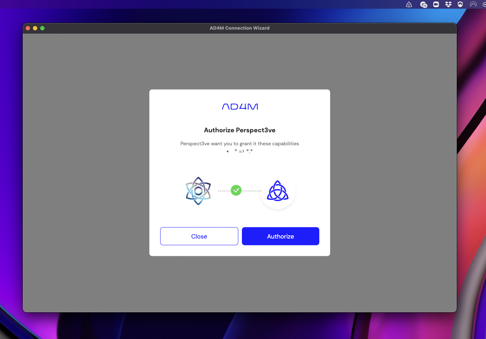
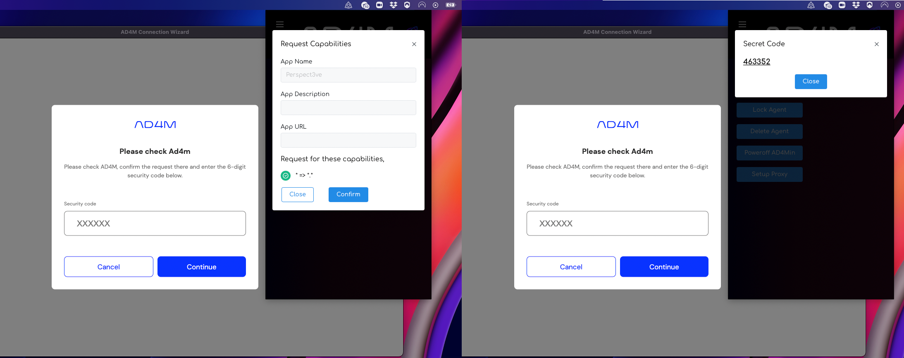

# Getting Started

## 1. Install AD4Min
Download the latest version of AD4Min, the complete AD4M implementation with admin UI from
its [GitHub release page](https://github.com/perspect3vism/ad4min/releases) and run/install it.

After successful agent initialization you should see an AD4M system-tray icon which will
bring up an AD4M pop-up window on click:


## 2. Setup app to connect to AD4M
First, install npm dependencies to your app/UI project:
```
npm install -s @perspect3vism/ad4m @perspect3vism/ad4m-connect
```
### Connect UI client using `ad4m-connect`

The AD4M-executor serves a GraphQL interface for UIs to connect to
and remote control the executor to use Languages, query and modify Perspectives etc.
That interface implements a capability-based security mechanism which allows for
making the local interface available publicly via a proxy ("setup proxy" button)
so that mobile UIs can call in to your ad4m-executor run at home,
but also to manage access to certain Perspectives/Neighbourhoods only to certain UIs.

Anyway, to not confront you with the complexity of writing code for requesting a
capability token and injecting it into a GraphQL client 
right at the start of your AD4M journey, 
there is [ad4m-connect](https://github.com/perspect3vism/ad4m-connect)
to do all of this for you and just deliver an initialized and usable
[Ad4mClient](api.md#class-ad4mclient) object.

#### Web/Browser UI

import it in the context of your root UI/component
```js
import '@perspect3vism/ad4m-connect'
```
and then add the `ad4m-connect` web component to your markup:
```html
<ad4m-connect
  appName="Perspect3ve"
  appDesc=""
  appDomain="org.perspect3vism.perspect3ve"
  capabilities='[{"with":{"domain":"*","pointers":["*"]},"can": ["*"]}]'
  appiconpath="./images/Perspect3ve-Logo.png"
></ad4m-connect>
```

This web component will create a modal dialog over your UI, 
but only if there is no capability token in the browsers localStorage yet.
After the first successful hand-shake, `ad4m-connect` will put the token there
and on next start-up of your app will check if the token still works and
not prompt the user again.

This is what your user will see when the app is not connected yet:


Since all the users's data is stored locally in AD4M Perspectives,
using a new app/UI and granting it access to all or parts of these perspectives
and AD4M functionality is potentially risky.
`ad4m-connect` not only makes it easy for app developers to connect to the users AD4M-executor,
it also provides a recognizable interface/wizard for the user.

Like in this example, an app/UI should provide its name and an icon for the user
to quickly understand what is going on.

The `capabilities` property must hold a string that defines what capability
(access to which perspectives and interface functions) should be requested.
This example requests all which might a good first step when starting to familiarize
yourself with AD4M, but should be restricted to what you really need for a production release.

If the user clicks authorize, `ad4m-connect` will connect to the AD4M-executor and request a capability token.
This will make AD4Min bring up its pop-up window:

Here the user has to confirm the request to their AD4M instance.
Next, AD4Min will then show a six-digit random secret code that needs to be entered into the app UI.
That way we have safely established that the network agent initiating the capability request (as seen from
the AD4M-executor) really is the UI the users wants to use.

If all steps were completed successfully, the `ad4m-connect` modal dialog closes and your app is shown.
Now you just need to get the `Ad4mClient` out of `ad4m-connect`.

Then somewhere in the initialization part of your app, do something like:
```typescript
import { Ad4mClient } from '@perspect3vism/ad4m'
import { getAd4mClient, onAuthStateChanged } from "@perspect3vism/ad4m-connect/web";

let ad4m: Ad4mClient = await new Promise((resolve, reject) => {
    onAuthStateChanged(async (status) => {
        if (status === "connected_with_capabilities") {
            alert("Connected  to Ad4m!");
            resolve(getAd4mClient())
        } else {
            alert("Not connected to Ad4m!");
        }
    })
})
```
Now you are ready to go and use the `ad4m` object to talk to the users AD4M-executor.
#### Node/Electron UI
`ad4m-connect` also works within an Electron app, but needs to be used a bit differently.
Instead of adding a web component to your UI, `ad4m-connect` will open its own Electron window
with that same UI component in it.
All you got to do is importing one function from `dist/electron` 
(best done in your) main Node/Electron start-up file)
```js
const { ad4mConnect } = require('@perspect3vism/ad4m-connect/dist/electron')
const path = require('path')

let ad4m: Ad4mClient = await new Promise((resolve, reject) => {
    ad4mConnect({
        appName: "Perspect3ve",
        appIconPath: path.join(__dirname, "graphics", "Logo.png"),
        capabilities: [{"with":{"domain":"*","pointers":["*"]},"can":["*"]}],
        dataPath: path.join(homedir(), '.perspect3ve')
    })
        .then(({client, capabilityToken, executorUrl}) => {
            resolve(client)
        })
        .catch(() => reject())
    }
})
```

There is one addition: `dataPath`.
The Node/Electron version of `ad4m-connect` stores the capability token (and executor URL)
to a file in the directory provided as `dataPath`.


## 3. Create a Perspective and add content
Adding a new perspective is as easy as
```js
const myPerspective = await ad4m.perspective.add("My new perspective")
```
The returned object is of type [PerspectiveProxy](api.md#class-perspectiveproxy),
which hides all the remote calls to the AD4M executor and can be treated like a
local database object.

Perspectives are basically local graph databases.
We can query all links on that proxy object with `get`:
```js
const allLinks = await myPerspective.get(new LinkQuery({})) // => []
```
In this case it should return an empty array since we just created that perspective.

So let's add something!
With the following code I'm creating an adhoc semantic statement
representing what I think about AD4M...
```js
import { Literal } from '@perspect3vism/ad4m'

const me = await ad4m.agent.me()
const source = me.did
const predicate = Literal.from("thinks").toUrl()
const target = Literal.from("AD4M will be the last social network").toUrl()

const linkExpresion = await myPerspective.add({source, predicate, target})
```

Links consist of 3 URIs pointing to Expressions of Languages.
For this example, we made life easy by using the agent's DID and AD4M's `Literal` Language.

### Agent DID
For the source of our link, we got the user's DID URI by first getting
the users [Agent](api.md#class-agent) object with `ad4m.agent.me()`.
That has a DID property and DID URIs are considered valid URIs in AD4M
(they can be looked-up using the Agent bootstrap language which resolves
to the same Agent object we got through `ad4m.agent.me()` - just even if
that agent behind the resolved DID isn't me).

### Literal
The `Literal` Language is an AD4M Language without back-end.
It stores JavaScript literals (i.e. strings, numbers and objects)
by encoding them into the Expression URL.
So, 
```js
Literal.from("thinks").toUrl()
``` 
returns `literal://string:thinks` - which is a valid URI -
and 
```js
Literal.from("AD4M will be the last social network").toUrl()
``` 
returns `literal://string:AD4M%20will%20be%20the%20last%20social%20network`.
This is basically like URL parameters and let's us get around introducing Languages
before using Perspectives and Links.

We can decode the URL into a JavaScript literal like so:
```js
const string = Literal.fromUrl('literal://string:thinks').get()
// string == 'thinks'
```

### LinkExpression
We have put in a [Link](api.md#class-link) object into `myPerspective.add()` 
(`{source, predicate, target}`),
but what this function returns is a [LinkExpression](api.md#class-linkexpression).

Even though this Perspective is not shared (yet) but just our private, local 
graph database, we might want to share it [later](#4-publish-perspective-as-neighbourhood)
as Neighbourhood.
Then, all links added by some agent to their local Perspective will be shared
with the other agents using a LinkLanguage - a Language which defines Expressions
representing Links. That is LinkExpressions.

Using the [generic Expression template](api.html#expressiongeneric),
LinkExpressions wrap Links with author, timestamp and signature:
```js
{
    author: "did:key:zQ3shNWd4bg67ktTVg9EMnnrsRjhkH6cRNCjRRxfTaTqBniAf",
    timestamp: "Sun Oct 23 2022 15:31:52 GMT+0200 (Central European Summer Time)",
    data: {
        source: "did:key:zQ3shNWd4bg67ktTVg9EMnnrsRjhkH6cRNCjRRxfTaTqBniAf",
        predicate: "literal://string:thinks",
        target: "literal://string:AD4M%20will%20be%20the%20last%20social%20network",
    },
    proof: {
        key: "#zQ3shNWd4bg67ktTVg9EMnnrsRjhkH6cRNCjRRxfTaTqBniAf",
        signature: "xxxx",
    }
}
```


## 4. Publish Perspective as Neighbourhood
The back-bone of a Neighbourhood is a *LinkLanguage* - a Language that enables the sharing
and thus synchronizing of links (see [LinksAdapter](api.html#linksadapter)). 
While there can and will be many different implementations
with different trade-offs and features (like membranes etc.),
there currently is one [fully implemented and Holochain based LinkLanguage with the name *Perspective Diff Sync*](https://github.com/perspect3vism/perspective-diff-sync).

It is deployed on the current test network (Language Language v0.0.15, included in [current network seed](https://github.com/perspect3vism/ad4m-seeds/blob/main/mainnetSeed.json)) under the address:
`QmeBD9n9Z5yZsegxArToww5zmwtPpojXN6zXJsi7WwMUa8`.

#### Creating our unique LinkLanguage clone through templating
But we should not just use this publicly known Language as the back-bone for our new Neighbourhood,
if we don't want to have everybody following this guide end up in the same network.

So what we want is to use this existing Language as a template and create a new copy with the same code
but different UUID and/name in order to create a fresh space for our new Neighbourhood.

What parameters can we adjust when using it as template?
Let's have a look at the Language's meta information:

```js
const socialContextMeta = await ad4m.languages.meta(
    "QmeBD9n9Z5yZsegxArToww5zmwtPpojXN6zXJsi7WwMUa8"
) 
console.log(socialContextMeta)
```

Which should yield something like this:
```
 {
  name: 'Perspective Diff Sync',
  address: 'QmeBD9n9Z5yZsegxArToww5zmwtPpojXN6zXJsi7WwMUa8',
  description: 'Holochain based LinkLanguage. First full implementation of a LinkLanguage, for collaborative Neighbourhoods where every agent can add links. No membrane. Basic template for all custom Neighbourhoods in this first iteration of the Perspect3vism test network.',
  author: 'did:key:zQ3shkkuZLvqeFgHdgZgFMUx8VGkgVWsLA83w2oekhZxoCW2n',
  templated: false,
  templateSourceLanguageAddress: null,
  templateAppliedParams: null,
  possibleTemplateParams: [ 'uuid', 'name', 'description' ],
  sourceCodeLink: 'https://github.com/perspect3vism/perspective-diff-sync'
}
```

The field `possibleTemplateParams` tells us that we can set a `UUID` and override `name` and `description`.
Let's leave description but change the name.
The function `languages.applyTemplateAndPublish()` takes an object as JSON as second parameter like so:


```js
const uniqueLinkLanguage = await ad4m.languages.applyTemplateAndPublish(
    "QmeBD9n9Z5yZsegxArToww5zmwtPpojXN6zXJsi7WwMUa8", 
    JSON.stringify({
        "uuid": "84a329-77384c-1510fb", 
        "name": "Perspective Diff Sync clone for demo Neighbourhood"
    }));
```

This function call has done a lot for us:
1. It took the source language (first parameter) and made sure we got the code,
i.e. potentially downloading it from the Language of Languages.
2. The provided template parameters have been applied. In the case of a Language using Holochain, it has unpacked the Holochain DNA, changed the DNA variables according to the values given as template parameters and packed the DNA again (not touching the WASM code)
3. The resulting Language was published with meta information showing that it was templated, providing the source hash and template parameters.

So the new templated Language is ready to be used.

### Creating the Neighbourhood
With that new LinkLanguage, actually creating the Neighbourhood is simple.
We just have to provide the id of the perspective we want to upgrade to a
Neighbourhood and the address of the LinkLanguage used for that:
```js
const meta = new Perspective()
const neighbourhoodUrl = await ad4m.neighbourhood.publishFromPerspective(
    myPerspective.uuid,
    uniqueLinkLanguage.address,
    meta
)
console.log(neighbourhoodUrl) // => neighbourhood://Qm123456789abcdef
```

The `meta` field a (static/snapshotted) Perspective that is immutably stored with
the Neighbourhood. It can hold arbitrary/semantic meta information about the
Neighbourhood but can technically stay empty, just like we did here.

## 5. Joining a Neighbourhood (on another node/agent)
Assume everything above happened on Alice's agent.
Alice now shares the Neighbourhood's URL with Bob.
This is what Bob does to join the Neigbourhood, access it as a (local) Perspective
and retrieve the Expression Alice created and linked there:
```js
const joinedNeighbourhood = await ad4m.neighbourhood.joinFromUrl(neighbourhoodUrl)
const myPerspective = await ad4m.perspective.byUUID(joinedNeighbourhood.uuid)
const links = await myPerspective.get(new LinkQuery({
    predicate: Literal.from("thinks").toUrl()
}))
links.forEach(async link => {
    const who = link.data.source
    const what = Literal.fromUrl(link.data.target).get()
    console.log(who, " thinks that ", what)
})
```

## 6. Listening to Perspective changes
Perspectives that have been turned into Neighbourhoods are like entangled particles.
Every agent still has their local copy of the Perspective, but a change from any agent
will be shared with all other agents immediately,
resulting in AD4M automatically updating the local Perspective with the changes by
the others.

Even with Perspectives that are not shared as Neighbourhood,
a different UI could have access to the same Perspective and cause mutations
on it.

Apps/UIs can simply register a listener function on that 
[PerspectiveProxy](api.md#class-perspectiveproxy) object:
```js
myPerspective.addListener('link-added', (addedLink: LinkExpression) => {
    console.log("Got a new link:", addedLink)
})

myPerspective.addListener('link-removed', (removedLink: LinkExpression) => {
    console.log("A link was removed:", removedLink)
})
```