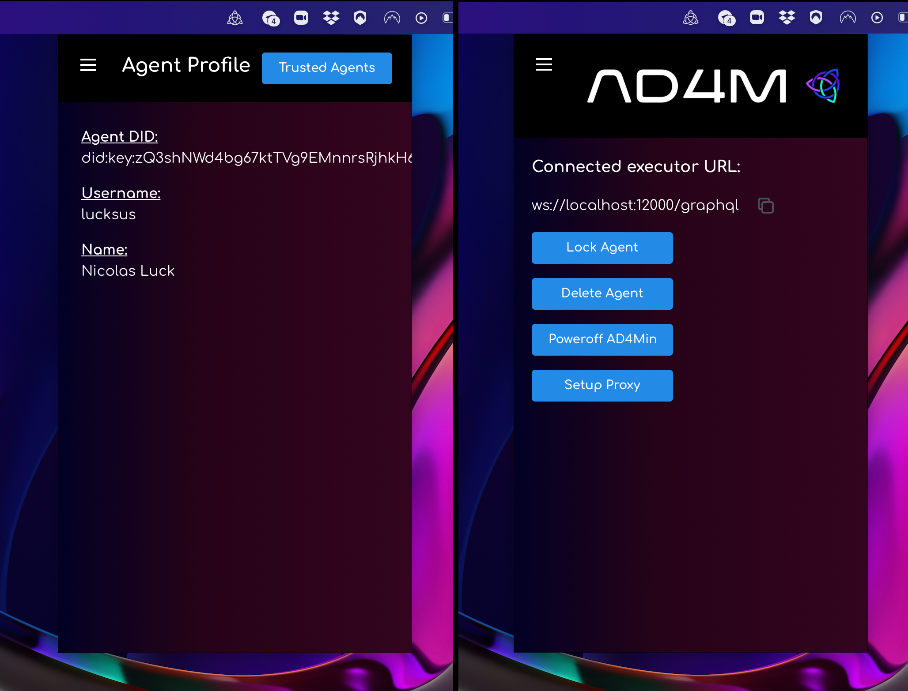

# Getting Started

## 1. Install AD4Min
Download the latest version of AD4Min, the complete AD4M implementation with admin UI from
its [GitHub release page](https://github.com/perspect3vism/ad4min/releases) and run/install it.

After successful agent initialization you should see an AD4M system-tray icon which will
bring up an AD4M pop-up window on click:


## 2. Connect UI client using `ad4m-connect`

The AD4M-executor serves a GraphQL interface for UIs to connect to
and remote control the executor to use Languages, query and modify Perspectives etc.
That interface implements a capability-based security mechanism which allows for
making the local interface available publicly via a proxy ("setup proxy" button)
so that mobile UIs can call in to your ad4m-executor run at home,
but also to manage access to certain Perspectives/Neighbourhoods only to certain UIs.

Anyway, to not confront you with the complexity of writing code for requesting a
capability token and injecting it into a GraphQL client 
right at the start of your AD4M journey, 
there is [ad4m-connect](https://github.com/perspect3vism/ad4m-connect)
to do all of this for you and just deliver an initialized and usable
[Ad4mClient](api.md#class-ad4mclient) object.

...


## 3. Use `Ad4mClient` to share links in a Neighbourhood

### Languages
For creating an expression we need to select a language that we create an expression in:
```js
const languages = await ad4mClient.languages.all()
const noteIpfsAddress = languages.find(l => l.name === 'note-ipfs').address
```
### Creating an Expression

```js
const exprAddress = await ad4mClient.expression.create("A new text note", noteIpfsAddress)
```

### Creating a Perspective and linking that new Expression
```js
const perspectiveHandle = await ad4mClient.perspective.add("A new perspective on apps...")
await ad4mClient.perspective.addLink(
    perspectiveHandle.uuid,
    new Link({
        source: 'root',
        target: exprAddress
    })
)
```

### Publishing that local Perspective by turning it into a Neighbourhood
The back-bone of a Neighbourhood is a *LinkLanguage* - a Language that enables the sharing
and thus synchronizing of links (see `LinksAdapter` in [Language.ts](src/language/Language.ts)). 
While there can and should be many different implementations
with different trade-offs and features (like membranes etc.),
there currently is one fully implemented and Holochain based LinkLanguage with the name *Social Context*.

It is deployed on the current test network (Language Language v0.0.5) under the address:
`QmZ1mkoY8nLvpxY3Mizx8UkUiwUzjxJxsqSTPPdH8sHxCQ`.

#### Creating our unique LinkLanguage clone through templating
But we should not just use this publicly known Language as the back-bone for our new Neighbourhood,
since we need a unique clone.
So what we want is to use this existing Language as a template and create a new copy with the same code
but different UUID and/name in order to create a fresh space for our new Neighbourhood.

What parameters can we adjust when using it as template?
Let's have a look at the Language's meta information:

```js
const socialContextMeta = await ad4mClient.languages.meta("QmZ1mkoY8nLvpxY3Mizx8UkUiwUzjxJxsqSTPPdH8sHxCQ") 

console.log(socialContextMeta)
```

Which should yield something like this:
```
 {
  name: 'social-context',
  address: 'QmZ1mkoY8nLvpxY3Mizx8UkUiwUzjxJxsqSTPPdH8sHxCQ',
  description: 'Holochain based LinkLanguage. First full implementation of a LinkLanguage, for collaborative Neighbourhoods where every agent can add links. No membrane. Basic template for all custom Neighbourhoods in this first iteration of the Perspect3vism test network.',
  author: 'did:key:zQ3shkkuZLvqeFgHdgZgFMUx8VGkgVWsLA83w2oekhZxoCW2n',
  templated: false,
  templateSourceLanguageAddress: null,
  templateAppliedParams: null,
  possibleTemplateParams: [ 'uuid', 'name', 'description' ],
  sourceCodeLink: 'https://github.com/juntofoundation/Social-Context'
}
```

The field `possibleTemplateParams` tells us that we can set a `UUID` and override `name` and `description`.
Let's leave description but change the name.
The function `languages.applyTemplateAndPublish()` takes an object as JSON as second parameter like so:


```js
const uniqueLinkLanguage = await ad4mClient.languages.applyTemplateAndPublish("QmZ1mkoY8nLvpxY3Mizx8UkUiwUzjxJxsqSTPPdH8sHxCQ", JSON.stringify({"uuid": "84a329-77384c-1510fb", "name": "Social Context clone for demo Neighbourhood"}));
```
And then use this new LinkLanguage in our Neighbourhood:
```js
const meta = new Perspective()
const neighbourhoodUrl = await ad4mClient.neighbourhood.publishFromPerspective(
    perspectiveHandle.uuid,
    uniqueLinkLanguage.address,
    meta
)
console.log(neighbourhoodUrl) // => neighbourhood://Qm123456789abcdef
```

### Joining a Neighbourhood (on another node/agent)
Assume everything above happened on Alice's agent.
Alice now shares the Neighbourhood's URL with Bob.
This is what Bob does to join the Neigbourhood, access it as a (local) Perspective
and retrieve the Expression Alice created and linked there:
```js
const joinedNeighbourhood = await ad4mClient.neighbourhood.joinFromUrl(neighbourhoodUrl)
const links = await ad4mClient.perspective.queryLinks(joinedNeighbourhood.uuid, new LinkQuery({source: 'a'}))
links.forEach(async link => {
    const address = link.data.target
    const expression = await ad4mClient.expression.get(address)
    const data = JSON.parse(expression.data)
    console.log(data) //=> "A new text note"
})
```

